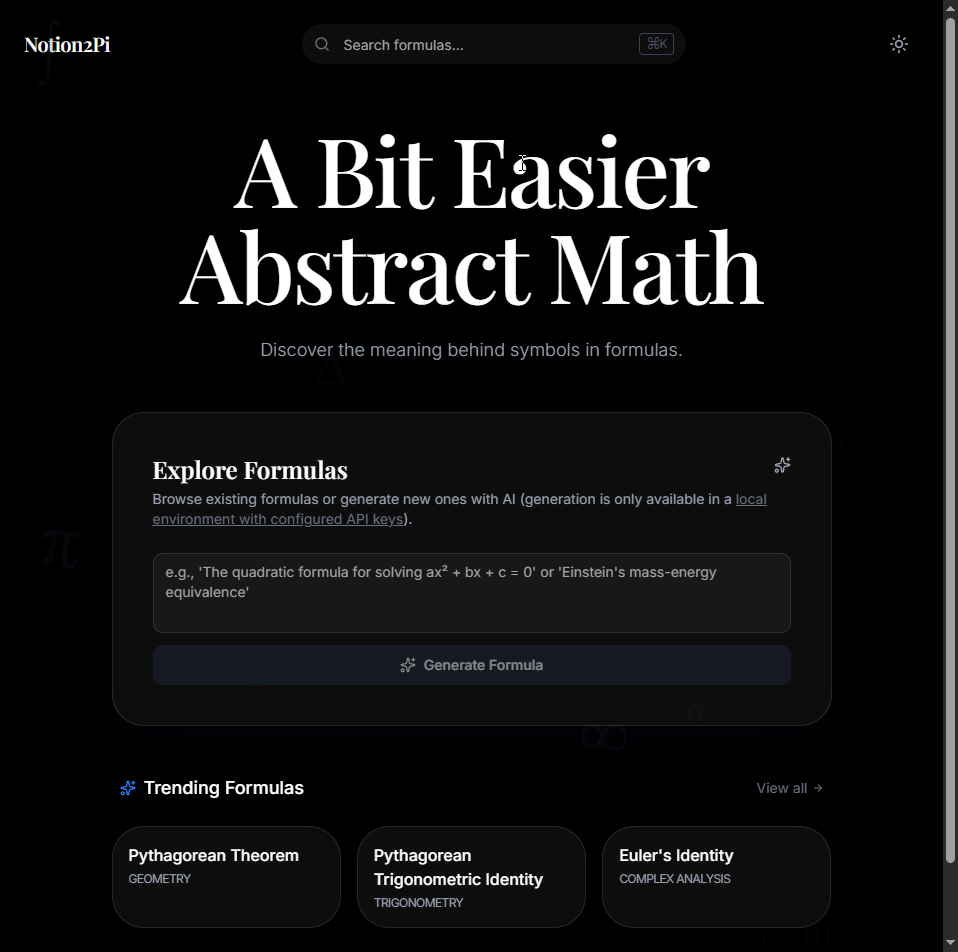

# Notion2Pi | Abstract Math Visualized



Notion2Pi is a modern web application that makes abstract mathematical formulas intuitive and accessible. By leveraging AI and a **7-Vector Analysis** framework, it transforms dense notation into interactive, educational experiences.

---

## Core Concept: The 7-Vector Analysis

Traditional mathematical definitions often fail to convey the *why* and *how* of a formula. Notion2Pi analyzes each formula across seven dimensions:

1. **Role** – The purpose each part serves mathematically.  
2. **Domain** – Input and output spaces.  
3. **Binding** – Relationships and connections between variables.  
4. **Variance** – Behavior of components as values change.  
5. **Geometric** – Visual or spatial representation.  
6. **Invariant** – Properties that remain constant under transformations.  
7. **Limits** – Behavior at mathematical extremes (0, ∞, etc.).

This framework allows users to understand formulas from multiple perspectives and gain a deeper conceptual grasp.


---

## Project Architecture

```bash
notion2pi/
├── app/                    # Next.js App Router
│   ├── browse/             # Formula catalog
│   ├── formula/[slug]/     # Dynamic formula visualization
│   └── layout.tsx          # Root layout & providers
├── components/             # Atomic Design Structure
│   ├── atoms/              # UI primitives (MixedLatexText, GlassPanel)
│   ├── molecules/          # Reusable patterns (SearchBars, ItemCards)
│   ├── features/           # Domain-specific logic (FormulaDetail, Generator)
│   └── shared/             # Cross-cutting components
├── lib/                    # Core Business Logic
│   ├── actions/            # Server actions for formula generation
│   ├── ai/                 # Multi-provider AI orchestration
│   ├── db/                 # Prisma client & database schemas
│   └── validators/         # Zod schemas for data integrity
├── prisma/                 # Database migrations & schema
├── public/                 # Static assets
└── types/                  # Global TypeScript definitions
```

---

## Getting Started

### Prerequisites
- [Bun](https://bun.sh/) (Recommended) or Node.js 18+
- [Prisma](https://www.prisma.io/)

### Installation
1. Clone the repository: `git clone <repo-url>`
2. Install dependencies: `bun install`
3. Setup Database: `bunx prisma migrate dev`
4. Run Development: `bun dev`

---

## AI Provider Setup

Notion2Pi supports multiple AI providers via a flexible orchestration layer. Configure your preferred provider in `.env`:

### Configuration Variables
| Variable | Description | Options |
| :--- | :--- | :--- |
| `AI_PROVIDER` | The active AI service | `openai`, `anthropic`, `google`, `groq`, `ollama` |
| `AI_MODEL` | Specific model to use | e.g. `gpt-4o`, `claude-3-5-sonnet-latest`, `gemini-1.5-flash` |
| `OLLAMA_BASE_URL` | Local endpoint for Ollama | e.g. `http://localhost:11434` |

### API Keys
Depending on your chosen provider, add the corresponding key:
- `OPENAI_API_KEY`
- `ANTHROPIC_API_KEY`
- `GOOGLE_GENERATIVE_AI_API_KEY`
- `GROQ_API_KEY`

---

## Author
**Mohamed Yassine Hemissi**

---

*This README.md was generated by AI.*